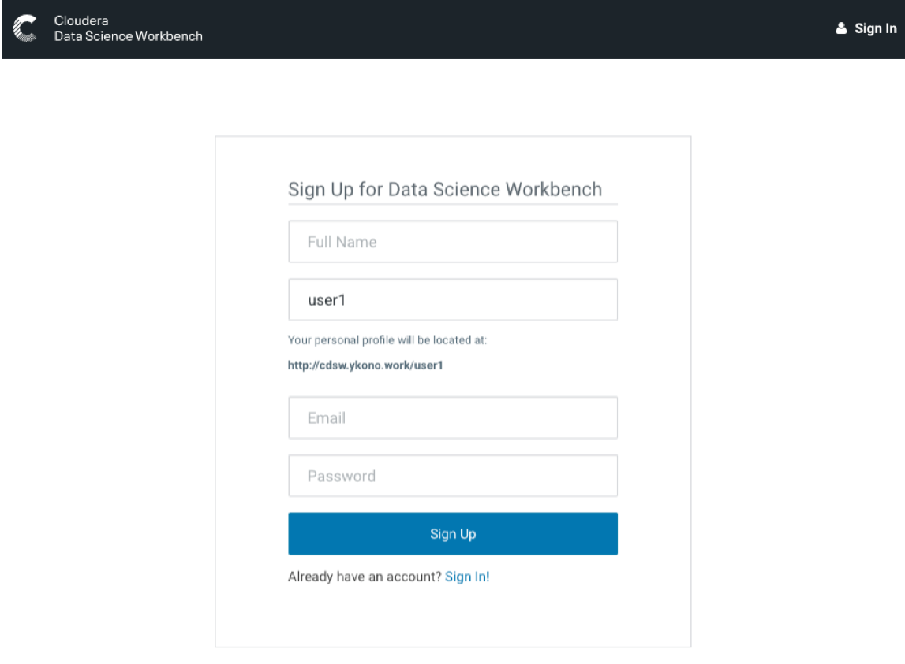
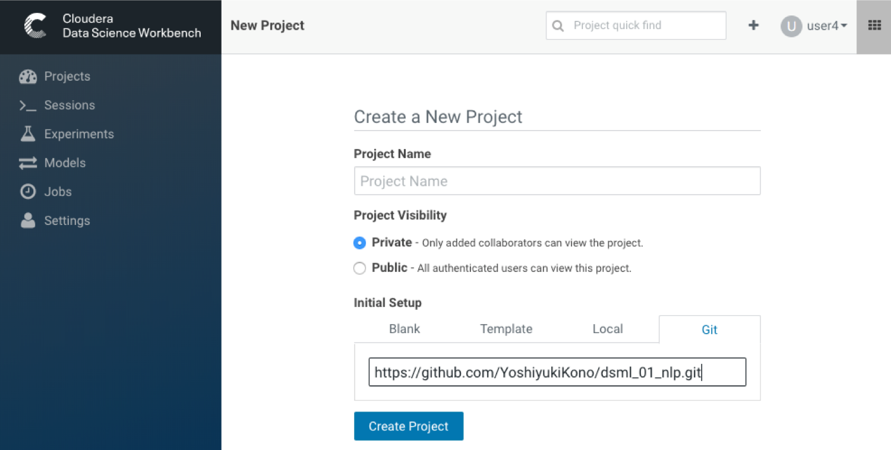
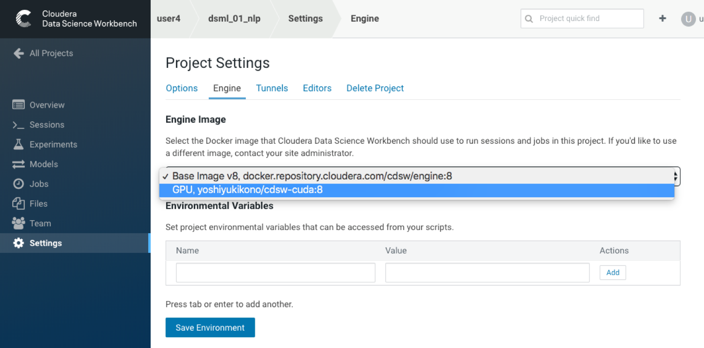
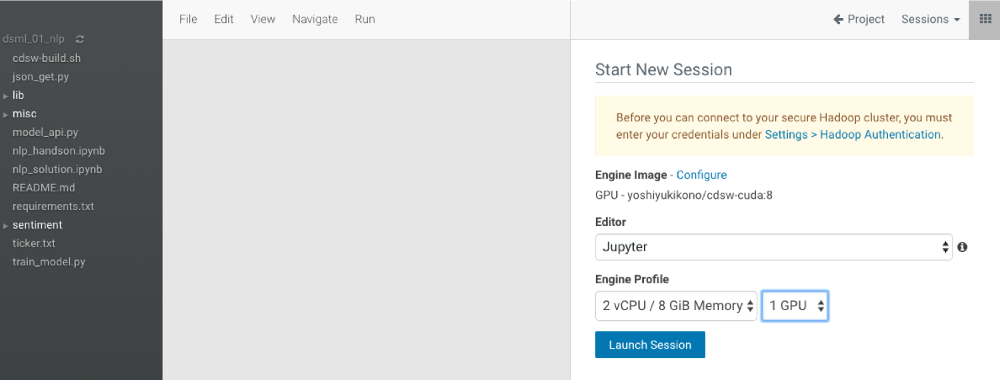

# 演習のためのCDSW操作上の注意点

## CDSWユーザの作成

CDSWのユーザ作成(Sign up)をご自身で実施していただきます。
アカウント名として、クラスター環境と一致するユーザ名を用います。

（演習の簡略化のために、上記のような構成としています。
クラスターのユーザ名とCDSWのユーザ名とに直接な関係を設定しないこと、ユーザが自分でアカウントを作成できないようにすることが可能です）

## 新規プロジェクトの作成

このGITHUBリポジトリのURLを使って、新規プロジェクトを作成します。

## 新規セッションの開始

新規セッションを開始される際に、下記をご確認ください。

モデルのトレーニングを行うセッションを開始する際に、GPUが利用できるエンジン・イメージを選択します。
（一旦選択されたエンジン・イメージが、次回のセッション起動の際にも用いられます）

エンジン・プロファイルのデフォルトは、GPUを使わない設定になっているため、セッションを開始する都度、変更が必要です。

トレーニングし、保存したモデルを使うためのセッションでは、デフォルトのエンジン・イメージを選択します。

